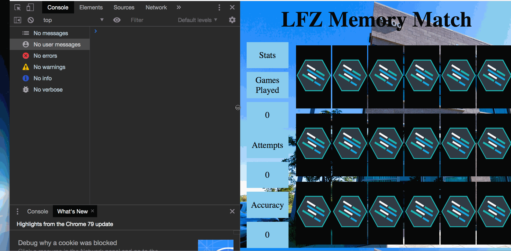
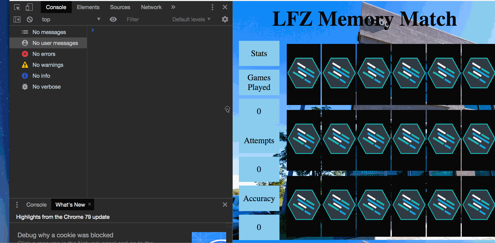
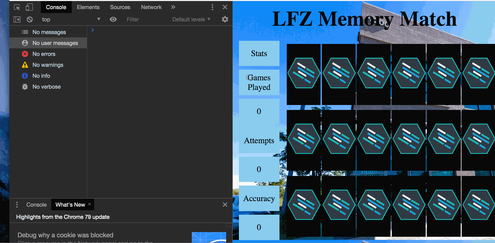
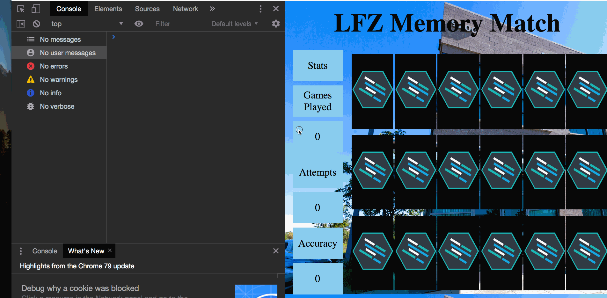
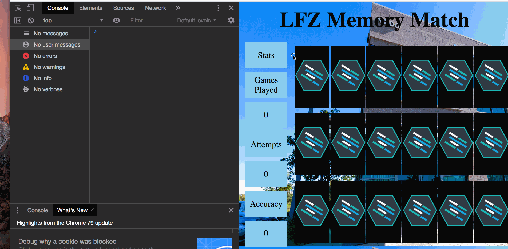
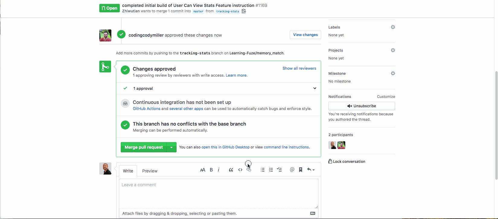

Instructions - User can Match Two Cards
--

### Overview

In this feature:
  - You are going to create the game logic necessary to compare two cards when they are clicked to check if the images which are revealed match each other.
  - Also, you will create the functionality to leave the cards revealed if they match, and hide them again if they do not match.
  - Finally, you will modify the functionality to prevent the user from clicking on more than two cards per round, and allow the game to handle multiple rounds of picking cards.

Let's look at a list of steps which must be accomplished for the Feature.

1. Create global variables to store references to cards which are clicked.
2. Create the logic to properly store the card references for the two cards clicked each round.
3. Retrieve the classes on the sibling elements of the cards which were clicked and stored.
4. Compare the classes of the sibling elements to see if they match.
5. Flipping the cards back if the classes for the background images do not match.
6. Creating a delay before the cards which don't match are flipped back.
7. Preventing clicks on more than two cards per round.
8. Adding click functionality back after round is complete.
9. Resetting the global variables to allow for multiple rounds.

Let's get started!

## 1. Create global variables to store references to cards which are clicked.

  - In order to compare two cards to check if the revealed images match, you must first create variables to store references to the cards which are clicked.
  - While initially it might seem like a good idea to create these variables within the `handleClick` function, doing so would quickly remind you of an important truth in JavaScript,
    - "Every function call creates an isolated scope for the variables within that function".
    - This means that you can not access variables within functions from outside the function!!!
    - For example, imagine that you create variables to store the card references within the `handleClick` function:
      - The first time you click a card and the `handleClick` function is called, a unique version of that function is created and the card is stored in a local variable within that version of the function.
      - The second time you click a card, a brand new version of the `handleClick` function is created, and that card is also stored in a local variable within the new version of function.
      - So now you have two versions of the `handleClick` function in memory, and no way for either of the `handleClick` functions to know which card reference the other has stored in local variables.
      - So what is the solution to this problem?
        - Global Variables!!!
    - Global Variables are declared in the `global space`:
      - This means they are declared outside of any function.
    - Because they are in the `global space`, they are accessible from anywhere in your code.
    - So because you want to be able to store the card references in a place where any version of the `handleClick` function can access them, you will be using global variables to store the references to the cards which are clicked.
    - `NOTE` `Scope` is a complex part of JavaScript, so it is ok if the above statements are not completely understood now.
    - The main thing to understand is that `local variables within functions are not accessible from outside the function`, so you must store information which all of your code needs access to in the global scope.
    - Here is a good article on scope related to ES5 [**Click Here**.](https://www.sitepoint.com/demystifying-javascript-variable-scope-hoisting/)
  - So with that little exploration of scope out of the way, let's create the variables we will need to store the correct card element information!
    - In the global scope of the `main.js` file, declare the following variables:
      - firstCardClicked
        - This variable will be used to store the first card which is clicked each round.
      - secondCardClicked
        - This variable will be used to store the second card which is clicked each round.
      - firstCardClasses
        - This variable will be used to store the classes of the `card-front` sibling to the first card which is clicked each round.
      - secondCardClasses
        - This variable will be used to store the classes of the `card-front` sibling to the second card which is clicked each round.
    - When your variables are properly declared, move on to the next step!

## 2. Create the logic to properly store the card references for the two cards clicked each round

  Now that you have variables in the global space which are prepared to store card references, it is time to update the code within the `handleClick` function.

  - Within the `handleClick` function, do the following:
    - Write a conditional statement which checks if the `firstCardClicked` variable has a truthy value assigned to it.
    - If `firstCardClicked` is falsy:
      - store the reference to the element which is assigned to the `target` property of the `event` parameter in the `firstCardClicked` variable.
    - If `firstCardClicked` is not falsy:
      - store the reference to the element which is assigned to the `target` property of the `event` parament in the `secondCardClicked` variable.
    - Let's take a moment to think about what this conditional check is doing:
      - If no truthy value has been assigned to the `firstCardClicked` variable yet, it means that no other cards have been clicked, so we want to store that card in the `firstCardClicked` variable.
      - If the `firstCardClicked` variable does have a truthy value assigned to it, that must mean that the card which was clicked is the second card clicked in the round, because the first card was already stored. So we then store that card in the `secondCardClicked` variable.
    - Now it is time to test your code:
      - place a console log for the `firstCardClicked` variable in the `if` code block of the conditional.
      - place a console log for the `secondCardClicked` variable in the `else` code block of the conditional.
      - Run your code and open the inspector to the console.
      - Click on two cards, you should see something similar to the example below:
      
      - When you have confirmed this functionality, remove the console logs and continue on to the next step.

## 3. Retrieve the classes on the sibling elements of the cards which were clicked and stored.

  - So now that you are properly storing references to the two cards which are clicked each round, it is time to retrieve the classes from the `card-front` sibling elements of the two cards which were clicked.
    - The purpose of this is as follows:
      - The background images you are using for the `card-front` elements are applied using CSS classes.
        - For example:
          - "js-logo"
          - "php-logo"
          - "docker-logo"
          - etc
      - So if you retrieve the classes of the `card-front` siblings on the cards you clicked, you can compare them to see if they have the same classes.
        - If the classes match, then background images must match!
      - With this understanding about the background images and thier CSS classes in mind, let's add some JavaScript to the `handleClick` function to store the `card-front` sibling class lists.
    - Within the `handleClick` function:
      - In the `if` conditional code block directly after you assign the card reference to the `firstCardClicked` variable:
        - assign the class names contained on the `card-front` sibling of the `firstCardClicked` element to the `firstCardClasses` global variable
      - In the `else` code block directly after you assign the card reference to the `secondCardClicked` variable:
        - assign the class names contained on the `card-front` sibling of the `secondCardClicked` element to the `secondCardClasses` global variable
      - Here is some documentation to help:
        - W3 Schools documentation on the previousElementSibling property: [**Click Here**](https://www.w3schools.com/jsref/prop_element_previouselementsibling.asp)
        - W3 Schools documentation on the className property: [**Click Here**](https://www.w3schools.com/jsref/prop_html_classname.asp)
      - Test your code by console logging the `firstCardClasses` and `secondCardClasses` variables after you have assigned them a value.
        - Run the code and click on two cards. Your console should be similar to the example below:
        
      - When you are successfully able to store the classes from the `card-front` sibling elements in both the `firstCardClasses` and `secondCardClasses` variables. Delete the test console logs and move on to the next step.

## 4. Compare the classes of the `card-front `sibling elements to see if they match.

  - Now that you are able to click on two cards and store the classes from their `card-front` siblings in the `firstCardClasses` and `secondCardClasses` variables, you can use those variables to check if the background images match!
  - Within the `handleClick` function do the following:
    - Within the `else` code block after you have assigned the `card-front` sibling classes to the `secondCardClass` variable:
      - Declare an `if` conditional which evaluates if `firstCardClasses` is === to `secondCardClasses`.
      - If the above evaluates to true:
        - console log "The images match"
      - If the above does not evaluate to true:
        - console log "the images do not match"
  - Now test your application by refreshing the page, opening the inspector, and clicking on two cards.
    - If they match, you should get "the images match" logged to the console.
    - If they don't match, you should get "the images do not match"
      - Note, you will have to refresh the page after each attempt.
      - Console example of proper functionality:
      

    - When you have confirmed the above functionality, delete the console logs and move on to the next step!

## 5. Flipping the cards back if they don't match.

  - Now that you have the functionality to check if the two revealed cards match, it is time to add functionality to hide the selected cards again if they don't match.
  - Within the `handleClick` function:
    - Within the `else` code block of the `firstCardClasses` is === to `secondCardClasses` conditional:
      - remove the `hidden` class from the elements whose references are stored in the `firstCardClicked` and `secondCardClick` variables.
      - Here is documentaion to help you:
        - W3 Schools documentation on the `classList` property: [**Click Here**](https://www.w3schools.com/jsref/prop_element_classlist.asp)
      - Working example of non-matching cards flipping back:
      
  - When you have completed the functionality of the cards flipping back over when they don't match, move on to the next step!

## 6. Creating a delay before the cards which don't match are flipped back.

  Now that you are able to sucessfully flip the cards back over when they don't match, it is time to add a delay between when the cards are selected and when they flip back.
  - Within the `handleClick` function:
    - Within the `else` code block of the previous step:
        - Using the `setTimeout` method, create a 1.5 second delay before the `hidden` class is removed from the `firstCardClicked` and `secondCardClick` elements.
        - W3Schools documentation on the `setTimeout` method:
        [**Click Here**](https://www.w3schools.com/jsref/met_win_settimeout.asp)
    - Completed functionality example:
      
    - When the delay is working properly on flipping back the unmatched cards, move on to the next step!

## 7. Preventing clicks on more than two cards per round.

  - With a proper delay before unmatched cards are flipped back over, the next step is to prevent more than two cards from being clicked in any single round.
    - Notice the following:
      
    This is not proper functionality for a matching game! Let's fix this!
    - The first thing to figure out is when you need to prevent any more cards from being clicked.
      - Because the code is checking whether or not two cards have matching images after the second card is clicked, it is directly after the second card reference is stored in `secondCardCliced` that you have to prevent any more cards from being clicked.
    - With the above in mind, do the following in the `handleClick` function:
      - After the second card has been clicked, and its `card-front` sibling's classes have been stored, remove the click event listener from the `main` element with the `id` of `gameCards`.
      - Documentation which might help:
        - MDN documentation on a useful method: [**Click Here**.](https://developer.mozilla.org/en-US/docs/Web/API/EventTarget/removeEventListener)
      - Example functionality:
      
    - When the above functionality is completed, move on to the next step!

## 8. Adding click functionality back after a round is complete.

  - Now that you have prevented the user from clicking on more that two cards per round, it is time to return click functionality to the cards after two cards have been clicked and checked for matching images.
  - So as you can probably guess, you will be required to add the click event listener back to the `main` element with the id of `gameCards` when the round is complete.
    - Within both the `if` and `else` code blocks of the `firstCardClasses` is === to `secondCardClasses` conditional statement, add the click event listener back onto the `main` element with the id of `gameCards`
      - You are doing it in both places because whether the cards match or not, you will need to be able to click on cards for the next round.
    - Example of completed functionality:
    

    - When you have completed the above functionality, move on to the next step!

## 9. Resetting the global variables to allow for multiple rounds.

  - You may have noticed that when you clicked on a third card after the others reset in the previous step that the single card also flipped back over. This is because our global variables which are storing the cards are not being reset between rounds!
  - To further clarify, after the `firstCardClicked` variable has been assigned a truthy value, the conditional statement which is checking if the `firstCardClicked` variable contains a falsy value will always evaluate to false.
    - This means that every card which is clicked after the first card will always be assigned to the `secondCardClicked` variable, and that the card reference stored in the `firstCardClicked` variable will never change!
    - To fix this, you will need to reset the `firstCardClicked` and `secondCardClicked` to a falsy value after the round is complete.
    - With the above in mind, assign the `firstCardClicked` and `secondCardClicked` a `null` value if the cards match, and if they don't match.
    - Example completed functionality:
      

  - When your app's functionality matches the example, and you are able to play multiple rounds of matching and not matching cards, Congratulations!!! you have completed this Feature!!!
  - Please move on the the `After Each Feature` section.

### After Each Feature

- When your feature implementation is complete, you will want to save and submit your work to the branch that you have created.
  - Use `git status` to check that you are on the correct branch that represents your feature.
  - You will want to **add**, **commit**, and **push** the code that you have written to the appropriate Github repository.
    1. `git add .`
    2. `git commit -m "Description of the feature that you have implemented"`
       - e.g. `git commit -m "Added simple HTML skeleton"`
    3. `git push origin FEATURE_NAME_HERE`
       - e.g. `git push origin skeleton`

- Finally, you will want to create a pull request. This will merge the code from your newly **completed** feature branch into your `master` branch.

  1. Navigate to <kbd>New Pull Request</kbd>:
  
  2. Compare changes to merge:
  
  3. Create a new pull request:
  
  4. Merge the pull request:
  
  5. Update master with the new changes:
  - Note: you must `checkout` to the `master` branch and then `git pull origin master` to update your local `master` branch with the new code you just merged into the remote `master` branch.
  
  6. Create a pull request from your `feature` branch to the `student-reviews` branch and send the pull request to your lead instructor in Slack.
    - You will be deleting this branch only `AFTER` your pull request has been approved!

  7. Go back to [Features](../../README.md#features), if you're still working through the project.
